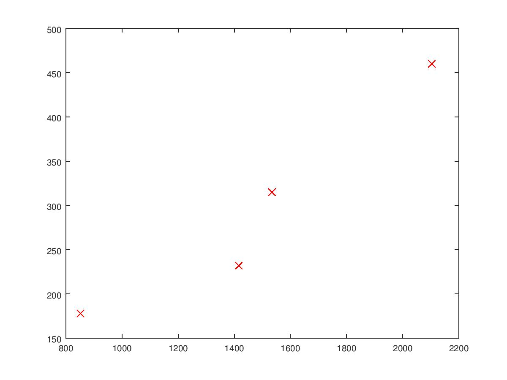
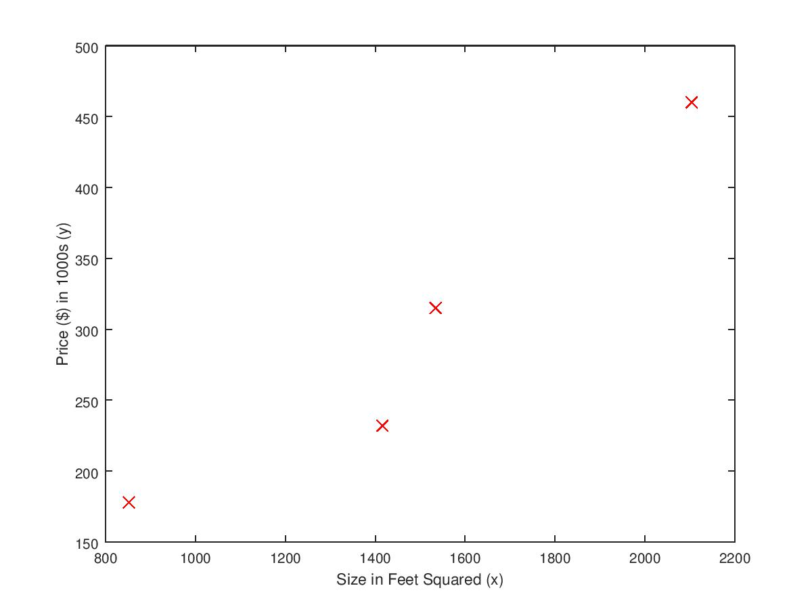

```Octave
# Create vector of even whole numbers between 31 & 75 
❯❯ 32:2:75
ans =
   32   34   36   38   40   42   44   46   48   50   52   54   56   58   60   62   64   66   68   70   72   74
# Ploting is trivial
❯❯ x=-10:10
-10   -9   -8   -7   -6   -5   -4   -3   -2   -1    0    1    2    3    4    5    6    7    8    9   10
# Plot included directly below
❯❯ plot(x,x.^2)
```

```Octave
# Definining matrices is trivial
❯❯ A=[3 1 2; -2 0 5]
A =
   3   1   2
  -2   0   5

❯❯ B=[-1 3; 0 5; 2 5]
B =
  -1   3
   0   5
   2   5

# Multiplying a 2x3 by a 3x2 gives you a 2x2
❯❯ A*B
ans =
    1   24
   12   19

# Multiplying a 3x2 by a 2x3 gives you a 3x3
❯❯ B*A
ans =
   -9   -1   13
  -10    0   25
   -4    2   29
```

```Octave
# Creating identity matrices is trivial
❯❯ I2=eye(2)
I2 =
Diagonal Matrix
   1   0
   0   1

❯❯ C=[11 23; 101 345]
C =
    11    23
   101   345

# Identity matrix times a matrix is that matrix
❯❯ I2*C
ans =
    11    23
   101   345

# Matrix times identity matrix is that matrix
❯❯ C*I2
ans =
    11    23
   101   345

❯❯ D=[3 -4; 2 -5]
D =
   3  -4
   2  -5
```

```Octave
# Calculating the inverse is trivial
❯❯ inv(D)
ans =
   0.71429  -0.57143
   0.28571  -0.42857

# Calculating the determinant is also trivial
❯❯ det(D)
ans = -7

# A matrix times its inverse is the identity matrix
❯❯ D*inv(D)
ans =
   1.00000   0.00000
  -0.00000   1.00000

❯❯ inv(D)*D
ans =
   1.00000   0.00000
   0.00000   1.00000
```

```Octave
# Let x = [2 5 1 6]
❯❯ x
x =
   2   5   1   6

# Add 16 to each element
❯❯ 16 + x
ans =
   18   21   17   22

# Add 3 to just the odd-index elements
❯❯ x + [3 0 3 0]
ans =
   5   5   4   6

# Compute the square root of each element
❯❯ sqrt(x)
ans =
   1.4142   2.2361   1.0000   2.4495

# Compute the square of each element
❯❯ x.^2
ans =
    4   25    1   36
```

```Octave
# Element-wise operations are easy
❯❯ E=[3 4; 7 8]
E =
   3   4
   7   8

❯❯ F=[8 2; 11 5]
F =
    8    2
   11    5

❯❯ E.*F
ans =
   24    8
   77   40
```

```Octave
❯❯ sizeInFeetSq=[2104 1416 1534 852]
sizeInFeetSq =
   2104   1416   1534    852

❯❯ priceInThousands=[460 232 315 178]
priceInThousands =
   460   232   315   178

# create a scatter plot
❯❯ scatter(sizeInFeetSq, priceInThousands)
```


```Octave
# You can also specify the marker type
❯❯ plot(sizeInFeetSq, priceInThousands, 'rx', 'MarkerSize', 8)
```


```Octave
# You can also define a function to plot
❯❯ function plotData(x,y)
> plot(x, y, 'rx', 'MarkerSize', 8)
> end
❯❯ plotData(sizeInFeetSq, priceInThousands);
❯❯ xlabel('Size in Feet Squared (x)');
❯❯ ylabel('Price ($) in 1000s (y)');
```



